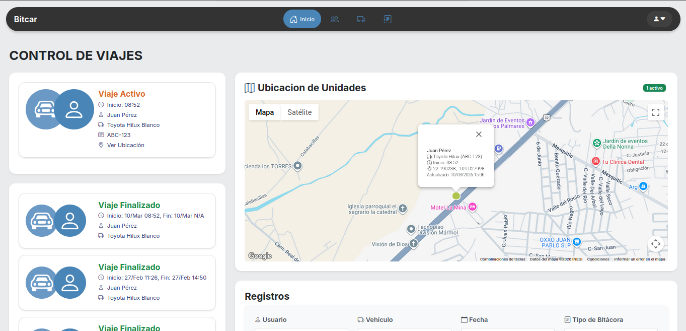
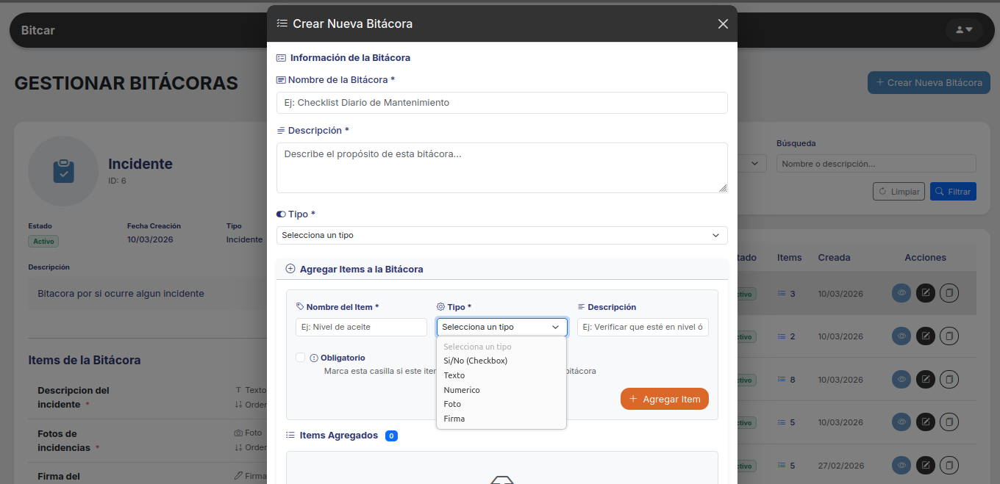
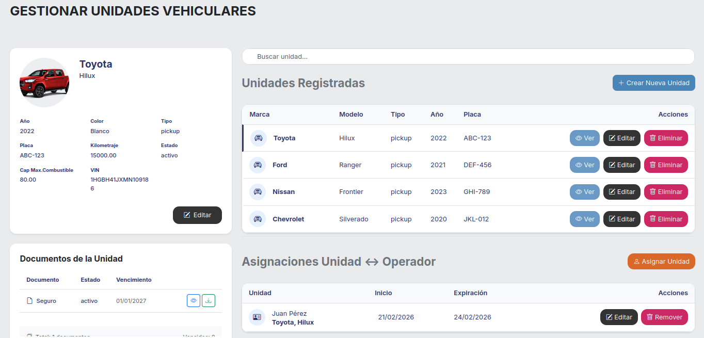

# BITCAR

## Descripción

Sistema de gestión de bitácoras, unidades vehiculares y operadores con panel web y [API REST para app móvil](https://github.com/AntonioMotaDev/BITCAR-MOBILE.git)

## Vista previa

## Características

- Gestión de vehículos, usuarios y bitácoras dinámicas. 
- Registro de entrada/salida de vehículo
- Gestión de incidencias
- Tracking GPS por viaje
<!-- - API autenticada con Sanctum -->

## Stack

- Laravel 12
- Blade + Bootstrap 5
- MySQL
- Laravel Breeze
- Laravel Sanctum
<!-- 
## Requisitos

- PHP 8.2+
- Composer
- Node.js y npm
- MySQL 8+ -->

<!-- 
## Endpoints principales

- `POST /api/v1/login`
- `POST /api/v1/logout`
- `GET /api/v1/checklists/active`
- `POST /api/v1/vehicle-logs/exit`
- `POST /api/v1/vehicle-logs/entry`
- `GET /api/v1/trips/active` -->

## Capturas 

## Licencia

Uso interno / privado.
